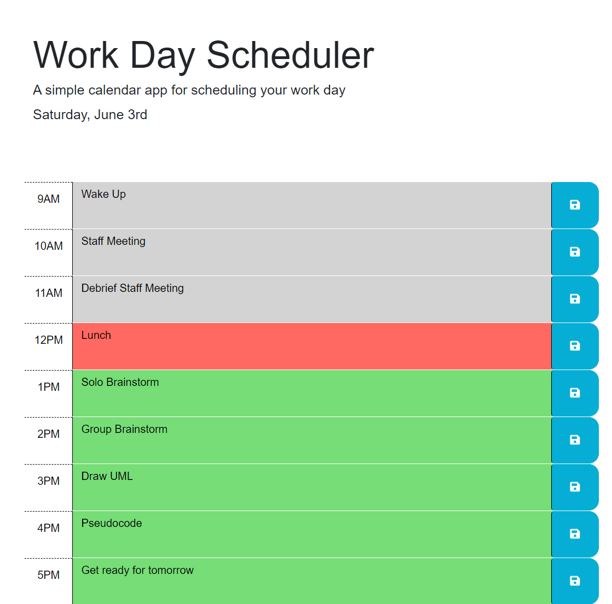

# Work Day Scheduler

## Description

This work day scheduler allows an employee with a busy schedule to add important events to a daily planner.  So that, they can manage their time effectively.  

This project taught me how to traverse the DOM using JQuery. In doing so, it taught me how to use the parent(), siblings(), and children() along with attr() methods to effectively traverse the DOM.  In addition, this project taught how to use the each() method when I want to refer to multiple elements of the same class. Furthermore, it reinforced my knowledge of the local storage.

## Installation
N/A

## Usage

To use the work day scheduler, simply visit https://fzhao888.github.io/Work-Day-Scheduler/ .  To get started, please type in important events into the colored text area and don't forget to click save to save the important events.  Enjoy!

Here is a screenshot of the work day scheduler:

## Credits
Shoutout to TA Chris for helping me understand how to traverse the DOM using JQuery.  

## License 

MIT License

